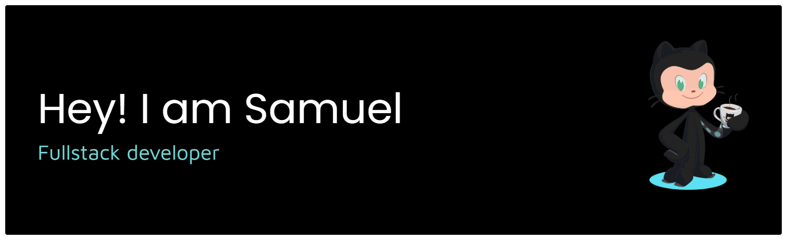

<h3 align="center">Hi, I'm Samuel — building under <a href="https://github.com/Sloane-J">Sloane.dev</a> 👋</h3>

Freelance full-stack developer based in Accra, Ghana. I build production-grade web apps for students, startups, and nonprofits.

 

## 🚀 Favourite Projects

<table>
  <tr>
    <td width="50%">
      <h3>📰 <a href="https://github.com/Sloane-J/Q-Vault-AdonisJS">Q-Vault Adonis</a></h3>
      
Past exam questions management system — upload and download past exam papers for registered schools.

      
<code>AdonisJS · EdgeJS</code>

    </td>
    <td width="50%">
      <h3>📽 <a href="https://github.com/Sloane-J/Youtube-Video-Downloader">YouTube Video/Playlist Downloader</a></h3>
      
Download YouTube videos or full playlists, with choice of audio or video quality.

      
<code>Flask</code>

    </td>
  </tr>
  <tr>
    <td width="50%">
      <h3>🗃 <a href="https://github.com/Sloane-J/Q-Vault">Q-Vault</a></h3>
      
Past exam questions management system — the original Laravel build.

      
<code>Laravel · Blade · Livewire</code>

    </td>
    <td width="50%">
      <h3>👨‍💻 <a href="https://github.com/Sloane-J/samueldjr">Portfolio Website</a></h3>
      
My personal portfolio site.

      
<code>Astro · React</code>

    </td>
  </tr>
</table>

 

## 🛠 Tools I Use

  
  
  
  
  
  
  
  
  
  
  
  
  
  
  
  
  
  
  
  
  
  
  
  
  
  
  
  
  
  
  
  
  
  
  

 

## 🔗 Let's Connect

  
  
  

 

  <a href="https://commit-history.com/Sloane-J">
    <picture>
      <source media="(prefers-color-scheme: dark)" srcset="https://commit-history.com/embed/Sloane-J?theme=dark" />
      
    </picture>
  </a>

